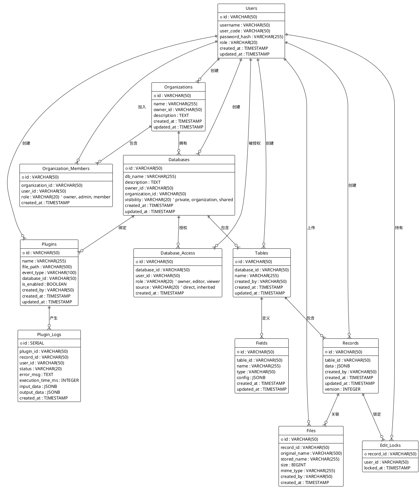

# 硬件工程数据管理平台 - 数据库设计文档

**版本**: v3.0
**日期**: 2026-01-05
**状态**: 设计完成 ✅
**技术栈**: PostgreSQL 15

---

## 1. 核心设计原则

### 1.1 多租户架构

**核心概念**：数据库 = Excel文件，表 = Sheet

```
组织 (Organization)
  ├─ 拥有多个 数据库 (Database)  ← 类似 Excel 文件
  │    └─ 包含多个 表 (Table)    ← 类似 Sheet
  │         └─ 包含多个 记录 (Record) ← 类似行数据
  │              └─ 关联 文件 (File)
  │
  └─ 拥有多个 成员 (User)

用户 (User)
  ├─ 可以创建个人数据库 (owner_id = user_id, organization_id = NULL)
  └─ 可以加入多个组织 (通过 organization_members)
```

**双重数据库模型**：
- **个人数据库**：用户创建，手动共享（类似个人Excel文件）
- **组织数据库**：组织创建，成员自动继承权限（类似共享文件夹）

**权限绑定**：所有权限在**数据库级别**，非表级别

### 1.2 字段命名规范

```sql
-- 用户表
users.username      -- 用户名（登录用）
users.user_code     -- 工号（可选）

-- 数据库表
databases.db_name   -- 数据库名称
```

### 1.3 主键设计

- 使用 `VARCHAR(50)` UUID 格式
- 带前缀便于识别：`usr_001`, `db_001`, `tbl_001`, `rec_001`
- 优势：分布式友好、调试方便、避免ID泄露

---

## 2. 实体关系概览 (PlantUML)



---

## 3. 表结构设计

### 3.1 用户表 (users)

```sql
CREATE TABLE users (
    id VARCHAR(50) PRIMARY KEY,
    username VARCHAR(50) NOT NULL,
    user_code VARCHAR(50),
    password_hash VARCHAR(255) NOT NULL,
    role VARCHAR(20) NOT NULL,
    created_at TIMESTAMP DEFAULT CURRENT_TIMESTAMP,
    updated_at TIMESTAMP DEFAULT CURRENT_TIMESTAMP
);

ALTER TABLE users ADD CONSTRAINT uq_users_username UNIQUE (username);
ALTER TABLE users ADD CONSTRAINT uq_users_user_code UNIQUE (user_code);
ALTER TABLE users ADD CONSTRAINT chk_users_role CHECK (role IN ('admin', 'user'));

CREATE INDEX idx_users_username ON users(username);
CREATE INDEX idx_users_user_code ON users(user_code);
```

**字段说明**：
- `id`: UUID，用户唯一标识（如 `usr_001`）
- `username`: 用户名，用于登录（唯一）
- `user_code`: 工号（可选，唯一）
- `password_hash`: bcrypt 加密密码
- `role`: 'admin'（系统管理员）或 'user'（普通用户）

---

### 3.2 组织表 (organizations)

```sql
CREATE TABLE organizations (
    id VARCHAR(50) PRIMARY KEY,
    name VARCHAR(255) NOT NULL,
    owner_id VARCHAR(50) NOT NULL,
    description TEXT,
    created_at TIMESTAMP DEFAULT CURRENT_TIMESTAMP,
    updated_at TIMESTAMP DEFAULT CURRENT_TIMESTAMP,
    FOREIGN KEY (owner_id) REFERENCES users(id) ON DELETE CASCADE
);

ALTER TABLE organizations ADD CONSTRAINT uq_organizations_name UNIQUE (name);
CREATE INDEX idx_organizations_owner_id ON organizations(owner_id);
CREATE INDEX idx_organizations_name ON organizations(name);
```

---

### 3.3 组织成员表 (organization_members)

```sql
CREATE TABLE organization_members (
    id VARCHAR(50) PRIMARY KEY,
    organization_id VARCHAR(50) NOT NULL,
    user_id VARCHAR(50) NOT NULL,
    role VARCHAR(20) NOT NULL,
    created_at TIMESTAMP DEFAULT CURRENT_TIMESTAMP,
    FOREIGN KEY (organization_id) REFERENCES organizations(id) ON DELETE CASCADE,
    FOREIGN KEY (user_id) REFERENCES users(id) ON DELETE CASCADE,
    UNIQUE (organization_id, user_id)
);

ALTER TABLE organization_members ADD CONSTRAINT chk_org_members_role
    CHECK (role IN ('owner', 'admin', 'member'));

CREATE INDEX idx_org_members_org_user ON organization_members(organization_id, user_id);
CREATE INDEX idx_org_members_user_org ON organization_members(user_id, organization_id);
```

**角色说明**：
- `owner`: 组织所有者（唯一）
- `admin`: 组织管理员
- `member`: 普通成员

---

### 3.4 数据库表 (databases) - 核心设计

```sql
CREATE TABLE databases (
    id VARCHAR(50) PRIMARY KEY,
    db_name VARCHAR(255) NOT NULL,
    description TEXT,
    owner_id VARCHAR(50) NOT NULL,
    organization_id VARCHAR(50),
    visibility VARCHAR(20) NOT NULL DEFAULT 'private',
    created_at TIMESTAMP DEFAULT CURRENT_TIMESTAMP,
    updated_at TIMESTAMP DEFAULT CURRENT_TIMESTAMP,
    FOREIGN KEY (owner_id) REFERENCES users(id) ON DELETE CASCADE,
    FOREIGN KEY (organization_id) REFERENCES organizations(id) ON DELETE CASCADE
);

ALTER TABLE databases ADD CONSTRAINT chk_databases_visibility
    CHECK (visibility IN ('private', 'organization', 'shared'));
ALTER TABLE databases ADD CONSTRAINT uq_databases_name_owner
    UNIQUE (db_name, owner_id) WHERE organization_id IS NULL;
ALTER TABLE databases ADD CONSTRAINT uq_databases_name_org
    UNIQUE (db_name, organization_id) WHERE organization_id IS NOT NULL;

CREATE INDEX idx_databases_owner_id ON databases(owner_id);
CREATE INDEX idx_databases_organization_id ON databases(organization_id);
CREATE INDEX idx_databases_visibility ON databases(visibility);
```

**双重模式设计**：

| 模式 | organization_id | visibility | 说明 |
|------|----------------|-----------|------|
| **个人数据库** | NULL | private/shared | 用户创建，手动共享 |
| **组织数据库** | 非NULL | organization/shared | 组织创建，成员继承 |

**visibility 说明**：
- `private`: 仅通过 database_access 授权
- `organization`: 组织内成员自动可见
- `shared`: 公开共享（未来扩展）

---

### 3.5 数据库权限表 (database_access)

```sql
CREATE TABLE database_access (
    id VARCHAR(50) PRIMARY KEY,
    database_id VARCHAR(50) NOT NULL,
    user_id VARCHAR(50) NOT NULL,
    role VARCHAR(20) NOT NULL,
    source VARCHAR(20) NOT NULL DEFAULT 'direct',
    created_at TIMESTAMP DEFAULT CURRENT_TIMESTAMP,
    FOREIGN KEY (database_id) REFERENCES databases(id) ON DELETE CASCADE,
    FOREIGN KEY (user_id) REFERENCES users(id) ON DELETE CASCADE,
    UNIQUE (database_id, user_id)
);

ALTER TABLE database_access ADD CONSTRAINT chk_database_access_role
    CHECK (role IN ('owner', 'editor', 'viewer'));

CREATE INDEX idx_database_access_db_user ON database_access(database_id, user_id);
CREATE INDEX idx_database_access_user_db ON database_access(user_id, database_id);
CREATE INDEX idx_database_access_source ON database_access(source);
```

**source 字段**：
- `direct`: 手动授权
- `inherited`: 组织继承（自动创建）

---

### 3.6 数据表 (tables)

```sql
CREATE TABLE tables (
    id VARCHAR(50) PRIMARY KEY,
    database_id VARCHAR(50) NOT NULL,
    name VARCHAR(255) NOT NULL,
    created_by VARCHAR(50) NOT NULL,
    created_at TIMESTAMP DEFAULT CURRENT_TIMESTAMP,
    updated_at TIMESTAMP DEFAULT CURRENT_TIMESTAMP,
    FOREIGN KEY (database_id) REFERENCES databases(id) ON DELETE CASCADE,
    FOREIGN KEY (created_by) REFERENCES users(id)
);

ALTER TABLE tables ADD CONSTRAINT uq_tables_name_db
    UNIQUE (database_id, name);

CREATE INDEX idx_tables_database_id ON tables(database_id);
CREATE INDEX idx_tables_created_by ON tables(created_by);
```

---

### 3.7 字段定义表 (fields)

```sql
CREATE TABLE fields (
    id VARCHAR(50) PRIMARY KEY,
    table_id VARCHAR(50) NOT NULL,
    name VARCHAR(255) NOT NULL,
    type VARCHAR(50) NOT NULL,
    config JSONB,
    created_at TIMESTAMP DEFAULT CURRENT_TIMESTAMP,
    updated_at TIMESTAMP DEFAULT CURRENT_TIMESTAMP,
    FOREIGN KEY (table_id) REFERENCES tables(id) ON DELETE CASCADE
);

ALTER TABLE fields ADD CONSTRAINT uq_fields_name_table
    UNIQUE (table_id, name);
ALTER TABLE fields ADD CONSTRAINT chk_fields_type
    CHECK (type IN ('text', 'number', 'date', 'single_select', 'relation', 'file'));

CREATE INDEX idx_fields_table_id ON fields(table_id);
```

**字段类型**：
- `text`: 单行文本
- `number`: 数字
- `date`: 日期
- `single_select`: 单选（config: `{"options": ["A", "B"]}`）
- `relation`: 关联记录（config: `{"related_table_id": "tbl_xxx"}`）
- `file`: 文件

---

### 3.8 业务数据记录表 (records)

```sql
CREATE TABLE records (
    id VARCHAR(50) PRIMARY KEY,
    table_id VARCHAR(50) NOT NULL,
    data JSONB NOT NULL,
    created_by VARCHAR(50) NOT NULL,
    created_at TIMESTAMP DEFAULT CURRENT_TIMESTAMP,
    updated_at TIMESTAMP DEFAULT CURRENT_TIMESTAMP,
    version INTEGER DEFAULT 1,
    FOREIGN KEY (table_id) REFERENCES tables(id) ON DELETE CASCADE,
    FOREIGN KEY (created_by) REFERENCES users(id)
);

CREATE INDEX idx_records_table_id ON records(table_id);
CREATE INDEX idx_records_created_by ON records(created_by);
CREATE INDEX idx_records_created_at ON records(created_at DESC);
CREATE INDEX idx_records_data_gin ON records USING gin (data);
```

**data 字段示例**：
```json
{
  "fld_001": "2024-01-15",
  "fld_002": 25.5,
  "fld_003": "正常"
}
```

---

### 3.9 文件表 (files)

```sql
CREATE TABLE files (
    id VARCHAR(50) PRIMARY KEY,
    record_id VARCHAR(50) NOT NULL,
    original_name VARCHAR(500) NOT NULL,
    stored_name VARCHAR(255) NOT NULL,
    size BIGINT NOT NULL,
    mime_type VARCHAR(255),
    created_by VARCHAR(50) NOT NULL,
    created_at TIMESTAMP DEFAULT CURRENT_TIMESTAMP,
    FOREIGN KEY (record_id) REFERENCES records(id) ON DELETE CASCADE,
    FOREIGN KEY (created_by) REFERENCES users(id)
);

CREATE INDEX idx_files_record_id ON files(record_id);
```

**存储路径**：`uploads/{database_id}/{table_id}/{record_id}/{stored_name}`

---

### 3.10 插件表 (plugins)

```sql
CREATE TABLE plugins (
    id VARCHAR(50) PRIMARY KEY,
    name VARCHAR(255) NOT NULL,
    file_path VARCHAR(500) NOT NULL,
    event_type VARCHAR(100) NOT NULL,
    database_id VARCHAR(50) NOT NULL,
    is_enabled BOOLEAN DEFAULT true,
    created_by VARCHAR(50) NOT NULL,
    created_at TIMESTAMP DEFAULT CURRENT_TIMESTAMP,
    updated_at TIMESTAMP DEFAULT CURRENT_TIMESTAMP,
    FOREIGN KEY (database_id) REFERENCES databases(id) ON DELETE CASCADE,
    FOREIGN KEY (created_by) REFERENCES users(id)
);

ALTER TABLE plugins ADD CONSTRAINT chk_plugins_event_type
    CHECK (event_type IN ('before_record_save', 'after_record_save', 'before_record_delete'));

CREATE INDEX idx_plugins_database_id ON plugins(database_id);
CREATE INDEX idx_plugins_enabled ON plugins(is_enabled) WHERE is_enabled = true;
```

**事件类型**：
- `before_record_save`: 保存前触发（可修改数据）
- `after_record_save`: 保存后触发（通知、审计）
- `before_record_delete`: 删除前触发（备份、校验）

---

### 3.11 插件日志表 (plugin_logs)

```sql
CREATE TABLE plugin_logs (
    id SERIAL PRIMARY KEY,
    plugin_id VARCHAR(50) NOT NULL,
    record_id VARCHAR(50),
    user_id VARCHAR(50),
    status VARCHAR(20) NOT NULL,
    error_msg TEXT,
    execution_time_ms INTEGER,
    input_data JSONB,
    output_data JSONB,
    created_at TIMESTAMP DEFAULT CURRENT_TIMESTAMP,
    FOREIGN KEY (plugin_id) REFERENCES plugins(id) ON DELETE CASCADE,
    FOREIGN KEY (user_id) REFERENCES users(id)
);

ALTER TABLE plugin_logs ADD CONSTRAINT chk_plugin_logs_status
    CHECK (status IN ('success', 'failed'));

CREATE INDEX idx_plugin_logs_plugin_id ON plugin_logs(plugin_id);
CREATE INDEX idx_plugin_logs_created_at ON plugin_logs(created_at DESC);
CREATE INDEX idx_plugin_logs_record_id ON plugin_logs(record_id);
```

---

### 3.12 编辑锁表 (edit_locks)

```sql
CREATE TABLE edit_locks (
    record_id VARCHAR(50) PRIMARY KEY,
    user_id VARCHAR(50) NOT NULL,
    locked_at TIMESTAMP DEFAULT CURRENT_TIMESTAMP,
    FOREIGN KEY (record_id) REFERENCES records(id) ON DELETE CASCADE,
    FOREIGN KEY (user_id) REFERENCES users(id)
);

CREATE INDEX idx_edit_locks_recent ON edit_locks(locked_at)
    WHERE locked_at > NOW() - INTERVAL '10 minutes';
```

---

### 3.13 Token黑名单表 (token_blacklist)

```sql
CREATE TABLE token_blacklist (
    token_hash VARCHAR(64) PRIMARY KEY,
    expired_at TIMESTAMPTZ NOT NULL,
    created_at TIMESTAMPTZ DEFAULT NOW()
);

CREATE INDEX idx_blacklist_expired ON token_blacklist(expired_at)
    WHERE expired_at > NOW();
```

**设计说明：**
- `token_hash`: SHA256哈希值（64字符），避免存储明文token
- `expired_at`: token过期时间，用于自动清理
- 使用主键查询，性能优异（<1ms）

**使用场景：**
- 用户登出时，将token存入此表
- JWT验证时，检查token是否在黑名单中
- 定期清理过期记录（每天凌晨）

**清理脚本：**
```sql
-- 每天凌晨执行
DELETE FROM token_blacklist WHERE expired_at < NOW();
```

---

## 4. 权限继承与业务规则

### 4.1 权限继承规则

```
用户权限计算流程：

1. 系统管理员？
   └─ ✅ 拥有所有权限

2. 数据库所有者？
   └─ ✅ 拥有 owner 权限

3. 直接授权 (database_access)？
   └─ ✅ 按配置角色

4. 组织数据库 + 组织角色？
   ├─ 组织所有者 → owner 权限
   ├─ 组织管理员 → editor 权限
   └─ 组织成员 → 需要手动授权

5. 以上都不满足？
   └─ ❌ 拒绝访问
```

### 4.2 权限矩阵

| 角色 | 表管理 | 字段管理 | 数据操作 | 插件管理 | 数据导出 |
|------|--------|----------|----------|----------|----------|
| **所有者** | ✅ 创建/删除 | ✅ 创建/修改/删除 | ✅ 增删改查 | 查看日志 | 全量/分页 |
| **编辑者** | ✅ 创建/删除 | ✅ 创建/修改/删除 | ✅ 增删改查 | ❌ | 分页导出 |
| **查看者** | ❌ | ❌ | 👁️ 只读 | ❌ | 分页导出 |
| **管理员** | 系统级 | 系统级 | 系统级 | 上传/启用/禁用/日志 | 系统级 |

---

## 5. 性能优化设计

### 5.1 核心索引策略

```sql
-- 1. 用户表
CREATE INDEX idx_users_username ON users(username);
CREATE INDEX idx_users_user_code ON users(user_code);

-- 2. 组织成员表（复合索引，支持双向查询）
CREATE INDEX idx_org_members_org_user ON organization_members(organization_id, user_id);
CREATE INDEX idx_org_members_user_org ON organization_members(user_id, organization_id);

-- 3. 数据库表
CREATE INDEX idx_databases_owner_id ON databases(owner_id);
CREATE INDEX idx_databases_organization_id ON databases(organization_id);

-- 4. 权限表（复合索引，支持双向查询）
CREATE INDEX idx_database_access_db_user ON database_access(database_id, user_id);
CREATE INDEX idx_database_access_user_db ON database_access(user_id, database_id);

-- 5. 记录表（核心查询路径）
CREATE INDEX idx_records_table_id ON records(table_id);
CREATE INDEX idx_records_created_at ON records(created_at DESC);

-- 6. JSONB GIN索引
CREATE INDEX idx_records_data_gin ON records USING gin (data);

-- 7. 部分索引（优化）
CREATE INDEX idx_plugins_enabled ON plugins(is_enabled) WHERE is_enabled = true;
CREATE INDEX idx_edit_locks_recent ON edit_locks(locked_at)
    WHERE locked_at > NOW() - INTERVAL '10 minutes';
```

### 5.2 物化视图（权限缓存）

```sql
CREATE MATERIALIZED VIEW user_database_permissions AS
SELECT
    da.user_id,
    da.database_id,
    da.role,
    da.source,
    d.owner_id,
    d.organization_id,
    d.visibility,
    CASE
        WHEN da.user_id = d.owner_id THEN 'owner'
        ELSE da.role
    END AS effective_role
FROM database_access da
JOIN databases d ON da.database_id = d.id;

CREATE INDEX idx_user_db_perm ON user_database_permissions(user_id, database_id);

-- 定期刷新（建议每5分钟）
REFRESH MATERIALIZED VIEW CONCURRENTLY user_database_permissions;
```

### 5.3 查询优化示例

```sql
-- ❌ 优化前：多次查询
SELECT * FROM databases WHERE owner_id = ?;
SELECT * FROM database_access WHERE user_id = ?;
SELECT * FROM organization_members WHERE user_id = ?;

-- ✅ 优化后：使用物化视图
SELECT d.*, dp.role, dp.source
FROM databases d
JOIN user_database_permissions dp ON d.id = dp.database_id
WHERE dp.user_id = ?;

-- JSONB查询（使用GIN索引）
SELECT * FROM records
WHERE table_id = 'tbl_001'
  AND data @> '{"fld_003": "正常"}';
```

---

## 6. 触发器与自动化

### 6.1 自动更新时间

```sql
CREATE OR REPLACE FUNCTION update_updated_at_column()
RETURNS TRIGGER AS $$
BEGIN
    NEW.updated_at = CURRENT_TIMESTAMP;
    RETURN NEW;
END;
$$ LANGUAGE plpgsql;

-- 为所有需要的表添加触发器
CREATE TRIGGER update_users_updated_at BEFORE UPDATE ON users
    FOR EACH ROW EXECUTE FUNCTION update_updated_at_column();
CREATE TRIGGER update_databases_updated_at BEFORE UPDATE ON databases
    FOR EACH ROW EXECUTE FUNCTION update_updated_at_column();
CREATE TRIGGER update_tables_updated_at BEFORE UPDATE ON tables
    FOR EACH ROW EXECUTE FUNCTION update_updated_at_column();
CREATE TRIGGER update_fields_updated_at BEFORE UPDATE ON fields
    FOR EACH ROW EXECUTE FUNCTION update_updated_at_column();
CREATE TRIGGER update_records_updated_at BEFORE UPDATE ON records
    FOR EACH ROW EXECUTE FUNCTION update_updated_at_column();
CREATE TRIGGER update_plugins_updated_at BEFORE UPDATE ON plugins
    FOR EACH ROW EXECUTE FUNCTION update_updated_at_column();
CREATE TRIGGER update_organizations_updated_at BEFORE UPDATE ON organizations
    FOR EACH ROW EXECUTE FUNCTION update_updated_at_column();
```

### 6.2 权限继承自动化

```sql
CREATE OR REPLACE FUNCTION sync_org_database_access()
RETURNS TRIGGER AS $$
DECLARE
    org_role VARCHAR(20);
    effective_role VARCHAR(20);
BEGIN
    -- 仅处理组织数据库
    IF NEW.organization_id IS NULL THEN
        RETURN NEW;
    END IF;

    -- 获取组织成员的继承权限
    FOR org_role IN
        SELECT role FROM organization_members WHERE organization_id = NEW.organization_id
    LOOP
        -- 组织所有者/管理员自动获得权限
        IF org_role = 'owner' THEN
            effective_role := 'owner';
        ELSIF org_role = 'admin' THEN
            effective_role := 'editor';
        ELSE
            CONTINUE; -- 普通成员不自动继承
        END IF;

        -- 插入继承权限（如果不存在）
        INSERT INTO database_access (id, database_id, user_id, role, source)
        VALUES (gen_random_uuid()::text, NEW.id, NEW.owner_id, effective_role, 'inherited')
        ON CONFLICT DO NOTHING;
    END LOOP;

    RETURN NEW;
END;
$$ LANGUAGE plpgsql;

CREATE TRIGGER trigger_sync_org_access AFTER INSERT ON databases
    FOR EACH ROW EXECUTE FUNCTION sync_org_database_access();
```

---

## 7. 存储过程

### 7.1 权限检查

```sql
CREATE OR REPLACE FUNCTION check_database_permission(
    p_user_id VARCHAR(50),
    p_database_id VARCHAR(50),
    p_required_role VARCHAR(20)
)
RETURNS BOOLEAN AS $$
DECLARE
    has_permission BOOLEAN;
BEGIN
    -- 1. 检查系统管理员
    IF EXISTS (SELECT 1 FROM users WHERE id = p_user_id AND role = 'admin') THEN
        RETURN TRUE;
    END IF;

    -- 2. 检查数据库所有者
    IF EXISTS (SELECT 1 FROM databases WHERE id = p_database_id AND owner_id = p_user_id) THEN
        RETURN TRUE;
    END IF;

    -- 3. 检查直接授权或继承权限
    SELECT EXISTS (
        SELECT 1 FROM user_database_permissions
        WHERE user_id = p_user_id
          AND database_id = p_database_id
          AND (
              effective_role = 'owner' OR
              (effective_role = 'editor' AND p_required_role IN ('editor', 'viewer')) OR
              (effective_role = 'viewer' AND p_required_role = 'viewer')
          )
    ) INTO has_permission;

    RETURN has_permission;
END;
$$ LANGUAGE plpgsql;
```

---

## 8. 业务流程示例

### 8.1 用户创建个人数据库

```
1. 用户 usr_002 登录
2. 创建数据库 "我的实验数据"
   → databases (db_001, owner_id=usr_002, organization_id=NULL, visibility='private')
3. 自动获得 owner 权限
   → database_access (dbacc_001, role='owner', source='direct')
4. 创建表、字段、录入数据...
```

### 8.2 组织数据库与权限继承

```
1. 用户张三创建组织 "硬件研发部"
   → organizations (org_001, owner_id=张三)

2. 添加成员李四、王五
   → organization_members (李四: admin, 王五: member)

3. 创建组织数据库 "部门实验数据"
   → databases (db_001, organization_id=org_001, visibility='organization')

4. 触发器自动执行：
   - 张三 (owner) → database_access (role='owner', source='inherited')
   - 李四 (admin) → database_access (role='editor', source='inherited')
   - 王五 (member) → 无自动权限

5. 张三给王五授权 viewer
   → database_access (user_id=王五, role='viewer', source='direct')
```

### 8.3 插件执行流程

```
用户保存记录
    ↓
权限校验 (check_database_permission)
    ↓
查询启用插件 (WHERE is_enabled=true)
    ↓
构造 Payload (JSON)
    ↓
启动子进程 (exec.Command)
    ↓
插件执行 (5秒超时)
    ├─ stdin: JSON payload
    ├─ stdout: JSON result
    └─ stderr: 错误信息
    ↓
记录日志 (plugin_logs)
    ↓
更新数据 / 返回错误
```

### 8.4 乐观锁与编辑锁

**乐观锁（防并发冲突）**：
```
1. 用户A读取记录 → version=1
2. 用户B读取记录 → version=1
3. 用户A提交更新 → 检查 version=1 → 更新成功 → version=2
4. 用户B提交更新 → 检查 version=2 ≠ 1 → 返回冲突错误
```

**编辑锁（防同时编辑）**：
```
1. 用户A打开编辑界面
   → POST /api/edit-locks {record_id: "rec_001"}
   → 写入 edit_locks 表

2. 用户B尝试编辑
   → GET /api/edit-locks/rec_001
   → 返回：正在被用户A编辑

3. 用户A关闭或超时（10分钟）
   → DELETE /api/edit-locks/rec_001
   → 或自动清理
```

---

## 9. 数据清理策略

```sql
-- 1. 插件日志保留30天
DELETE FROM plugin_logs WHERE created_at < NOW() - INTERVAL '30 days';

-- 2. 编辑锁自动清理（10分钟超时）
DELETE FROM edit_locks WHERE locked_at < NOW() - INTERVAL '10 minutes';

-- 3. 定期刷新物化视图（建议每5分钟）
REFRESH MATERIALIZED VIEW CONCURRENTLY user_database_permissions;
```

---

## 10. 完整建库脚本 (init.sql)

```sql
-- ============================================
-- 硬件工程数据管理平台 - 数据库初始化脚本
-- 版本: v3.0
-- 日期: 2026-01-05
-- ============================================

-- 启用扩展
CREATE EXTENSION IF NOT EXISTS "uuid-ossp";
CREATE EXTENSION IF NOT EXISTS "pg_trgm";

-- 1. 用户表
CREATE TABLE users (
    id VARCHAR(50) PRIMARY KEY,
    username VARCHAR(50) NOT NULL,
    user_code VARCHAR(50),
    password_hash VARCHAR(255) NOT NULL,
    role VARCHAR(20) NOT NULL,
    created_at TIMESTAMP DEFAULT CURRENT_TIMESTAMP,
    updated_at TIMESTAMP DEFAULT CURRENT_TIMESTAMP
);
ALTER TABLE users ADD CONSTRAINT uq_users_username UNIQUE (username);
ALTER TABLE users ADD CONSTRAINT uq_users_user_code UNIQUE (user_code);
ALTER TABLE users ADD CONSTRAINT chk_users_role CHECK (role IN ('admin', 'user'));
CREATE INDEX idx_users_username ON users(username);
CREATE INDEX idx_users_user_code ON users(user_code);

-- 2. 组织表
CREATE TABLE organizations (
    id VARCHAR(50) PRIMARY KEY,
    name VARCHAR(255) NOT NULL,
    owner_id VARCHAR(50) NOT NULL,
    description TEXT,
    created_at TIMESTAMP DEFAULT CURRENT_TIMESTAMP,
    updated_at TIMESTAMP DEFAULT CURRENT_TIMESTAMP,
    FOREIGN KEY (owner_id) REFERENCES users(id) ON DELETE CASCADE
);
ALTER TABLE organizations ADD CONSTRAINT uq_organizations_name UNIQUE (name);
CREATE INDEX idx_organizations_owner_id ON organizations(owner_id);
CREATE INDEX idx_organizations_name ON organizations(name);

-- 3. 组织成员表
CREATE TABLE organization_members (
    id VARCHAR(50) PRIMARY KEY,
    organization_id VARCHAR(50) NOT NULL,
    user_id VARCHAR(50) NOT NULL,
    role VARCHAR(20) NOT NULL,
    created_at TIMESTAMP DEFAULT CURRENT_TIMESTAMP,
    FOREIGN KEY (organization_id) REFERENCES organizations(id) ON DELETE CASCADE,
    FOREIGN KEY (user_id) REFERENCES users(id) ON DELETE CASCADE,
    UNIQUE (organization_id, user_id)
);
ALTER TABLE organization_members ADD CONSTRAINT chk_org_members_role
    CHECK (role IN ('owner', 'admin', 'member'));
CREATE INDEX idx_org_members_org_user ON organization_members(organization_id, user_id);
CREATE INDEX idx_org_members_user_org ON organization_members(user_id, organization_id);

-- 4. 数据库表
CREATE TABLE databases (
    id VARCHAR(50) PRIMARY KEY,
    db_name VARCHAR(255) NOT NULL,
    description TEXT,
    owner_id VARCHAR(50) NOT NULL,
    organization_id VARCHAR(50),
    visibility VARCHAR(20) NOT NULL DEFAULT 'private',
    created_at TIMESTAMP DEFAULT CURRENT_TIMESTAMP,
    updated_at TIMESTAMP DEFAULT CURRENT_TIMESTAMP,
    FOREIGN KEY (owner_id) REFERENCES users(id) ON DELETE CASCADE,
    FOREIGN KEY (organization_id) REFERENCES organizations(id) ON DELETE CASCADE
);
ALTER TABLE databases ADD CONSTRAINT chk_databases_visibility
    CHECK (visibility IN ('private', 'organization', 'shared'));
ALTER TABLE databases ADD CONSTRAINT uq_databases_name_owner
    UNIQUE (db_name, owner_id) WHERE organization_id IS NULL;
ALTER TABLE databases ADD CONSTRAINT uq_databases_name_org
    UNIQUE (db_name, organization_id) WHERE organization_id IS NOT NULL;
CREATE INDEX idx_databases_owner_id ON databases(owner_id);
CREATE INDEX idx_databases_organization_id ON databases(organization_id);
CREATE INDEX idx_databases_visibility ON databases(visibility);

-- 5. 数据库权限表
CREATE TABLE database_access (
    id VARCHAR(50) PRIMARY KEY,
    database_id VARCHAR(50) NOT NULL,
    user_id VARCHAR(50) NOT NULL,
    role VARCHAR(20) NOT NULL,
    source VARCHAR(20) NOT NULL DEFAULT 'direct',
    created_at TIMESTAMP DEFAULT CURRENT_TIMESTAMP,
    FOREIGN KEY (database_id) REFERENCES databases(id) ON DELETE CASCADE,
    FOREIGN KEY (user_id) REFERENCES users(id) ON DELETE CASCADE,
    UNIQUE (database_id, user_id)
);
ALTER TABLE database_access ADD CONSTRAINT chk_database_access_role
    CHECK (role IN ('owner', 'editor', 'viewer'));
CREATE INDEX idx_database_access_db_user ON database_access(database_id, user_id);
CREATE INDEX idx_database_access_user_db ON database_access(user_id, database_id);
CREATE INDEX idx_database_access_source ON database_access(source);

-- 6. 数据表
CREATE TABLE tables (
    id VARCHAR(50) PRIMARY KEY,
    database_id VARCHAR(50) NOT NULL,
    name VARCHAR(255) NOT NULL,
    created_by VARCHAR(50) NOT NULL,
    created_at TIMESTAMP DEFAULT CURRENT_TIMESTAMP,
    updated_at TIMESTAMP DEFAULT CURRENT_TIMESTAMP,
    FOREIGN KEY (database_id) REFERENCES databases(id) ON DELETE CASCADE,
    FOREIGN KEY (created_by) REFERENCES users(id)
);
ALTER TABLE tables ADD CONSTRAINT uq_tables_name_db
    UNIQUE (database_id, name);
CREATE INDEX idx_tables_database_id ON tables(database_id);
CREATE INDEX idx_tables_created_by ON tables(created_by);

-- 7. 字段定义表
CREATE TABLE fields (
    id VARCHAR(50) PRIMARY KEY,
    table_id VARCHAR(50) NOT NULL,
    name VARCHAR(255) NOT NULL,
    type VARCHAR(50) NOT NULL,
    config JSONB,
    created_at TIMESTAMP DEFAULT CURRENT_TIMESTAMP,
    updated_at TIMESTAMP DEFAULT CURRENT_TIMESTAMP,
    FOREIGN KEY (table_id) REFERENCES tables(id) ON DELETE CASCADE
);
ALTER TABLE fields ADD CONSTRAINT uq_fields_name_table
    UNIQUE (table_id, name);
ALTER TABLE fields ADD CONSTRAINT chk_fields_type
    CHECK (type IN ('text', 'number', 'date', 'single_select', 'relation', 'file'));
CREATE INDEX idx_fields_table_id ON fields(table_id);

-- 8. 业务数据记录表
CREATE TABLE records (
    id VARCHAR(50) PRIMARY KEY,
    table_id VARCHAR(50) NOT NULL,
    data JSONB NOT NULL,
    created_by VARCHAR(50) NOT NULL,
    created_at TIMESTAMP DEFAULT CURRENT_TIMESTAMP,
    updated_at TIMESTAMP DEFAULT CURRENT_TIMESTAMP,
    version INTEGER DEFAULT 1,
    FOREIGN KEY (table_id) REFERENCES tables(id) ON DELETE CASCADE,
    FOREIGN KEY (created_by) REFERENCES users(id)
);
CREATE INDEX idx_records_table_id ON records(table_id);
CREATE INDEX idx_records_created_by ON records(created_by);
CREATE INDEX idx_records_created_at ON records(created_at DESC);
CREATE INDEX idx_records_data_gin ON records USING gin (data);

-- 9. 文件表
CREATE TABLE files (
    id VARCHAR(50) PRIMARY KEY,
    record_id VARCHAR(50) NOT NULL,
    original_name VARCHAR(500) NOT NULL,
    stored_name VARCHAR(255) NOT NULL,
    size BIGINT NOT NULL,
    mime_type VARCHAR(255),
    created_by VARCHAR(50) NOT NULL,
    created_at TIMESTAMP DEFAULT CURRENT_TIMESTAMP,
    FOREIGN KEY (record_id) REFERENCES records(id) ON DELETE CASCADE,
    FOREIGN KEY (created_by) REFERENCES users(id)
);
CREATE INDEX idx_files_record_id ON files(record_id);

-- 10. 插件表
CREATE TABLE plugins (
    id VARCHAR(50) PRIMARY KEY,
    name VARCHAR(255) NOT NULL,
    file_path VARCHAR(500) NOT NULL,
    event_type VARCHAR(100) NOT NULL,
    database_id VARCHAR(50) NOT NULL,
    is_enabled BOOLEAN DEFAULT true,
    created_by VARCHAR(50) NOT NULL,
    created_at TIMESTAMP DEFAULT CURRENT_TIMESTAMP,
    updated_at TIMESTAMP DEFAULT CURRENT_TIMESTAMP,
    FOREIGN KEY (database_id) REFERENCES databases(id) ON DELETE CASCADE,
    FOREIGN KEY (created_by) REFERENCES users(id)
);
ALTER TABLE plugins ADD CONSTRAINT chk_plugins_event_type
    CHECK (event_type IN ('before_record_save', 'after_record_save', 'before_record_delete'));
CREATE INDEX idx_plugins_database_id ON plugins(database_id);
CREATE INDEX idx_plugins_enabled ON plugins(is_enabled) WHERE is_enabled = true;

-- 11. 插件日志表
CREATE TABLE plugin_logs (
    id SERIAL PRIMARY KEY,
    plugin_id VARCHAR(50) NOT NULL,
    record_id VARCHAR(50),
    user_id VARCHAR(50),
    status VARCHAR(20) NOT NULL,
    error_msg TEXT,
    execution_time_ms INTEGER,
    input_data JSONB,
    output_data JSONB,
    created_at TIMESTAMP DEFAULT CURRENT_TIMESTAMP,
    FOREIGN KEY (plugin_id) REFERENCES plugins(id) ON DELETE CASCADE,
    FOREIGN KEY (user_id) REFERENCES users(id)
);
ALTER TABLE plugin_logs ADD CONSTRAINT chk_plugin_logs_status
    CHECK (status IN ('success', 'failed'));
CREATE INDEX idx_plugin_logs_plugin_id ON plugin_logs(plugin_id);
CREATE INDEX idx_plugin_logs_created_at ON plugin_logs(created_at DESC);
CREATE INDEX idx_plugin_logs_record_id ON plugin_logs(record_id);

-- 12. 编辑锁表
CREATE TABLE edit_locks (
    record_id VARCHAR(50) PRIMARY KEY,
    user_id VARCHAR(50) NOT NULL,
    locked_at TIMESTAMP DEFAULT CURRENT_TIMESTAMP,
    FOREIGN KEY (record_id) REFERENCES records(id) ON DELETE CASCADE,
    FOREIGN KEY (user_id) REFERENCES users(id)
);
CREATE INDEX idx_edit_locks_recent ON edit_locks(locked_at)
    WHERE locked_at > NOW() - INTERVAL '10 minutes';

-- 触发器：自动更新时间
CREATE OR REPLACE FUNCTION update_updated_at_column()
RETURNS TRIGGER AS $$
BEGIN
    NEW.updated_at = CURRENT_TIMESTAMP;
    RETURN NEW;
END;
$$ LANGUAGE plpgsql;

CREATE TRIGGER update_users_updated_at BEFORE UPDATE ON users FOR EACH ROW EXECUTE FUNCTION update_updated_at_column();
CREATE TRIGGER update_databases_updated_at BEFORE UPDATE ON databases FOR EACH ROW EXECUTE FUNCTION update_updated_at_column();
CREATE TRIGGER update_tables_updated_at BEFORE UPDATE ON tables FOR EACH ROW EXECUTE FUNCTION update_updated_at_column();
CREATE TRIGGER update_fields_updated_at BEFORE UPDATE ON fields FOR EACH ROW EXECUTE FUNCTION update_updated_at_column();
CREATE TRIGGER update_records_updated_at BEFORE UPDATE ON records FOR EACH ROW EXECUTE FUNCTION update_updated_at_column();
CREATE TRIGGER update_plugins_updated_at BEFORE UPDATE ON plugins FOR EACH ROW EXECUTE FUNCTION update_updated_at_column();
CREATE TRIGGER update_organizations_updated_at BEFORE UPDATE ON organizations FOR EACH ROW EXECUTE FUNCTION update_updated_at_column();

-- 触发器：权限继承
CREATE OR REPLACE FUNCTION sync_org_database_access()
RETURNS TRIGGER AS $$
DECLARE
    org_role VARCHAR(20);
    effective_role VARCHAR(20);
BEGIN
    IF NEW.organization_id IS NULL THEN
        RETURN NEW;
    END IF;

    FOR org_role IN
        SELECT role FROM organization_members WHERE organization_id = NEW.organization_id
    LOOP
        IF org_role = 'owner' THEN
            effective_role := 'owner';
        ELSIF org_role = 'admin' THEN
            effective_role := 'editor';
        ELSE
            CONTINUE;
        END IF;

        INSERT INTO database_access (id, database_id, user_id, role, source)
        VALUES (gen_random_uuid()::text, NEW.id, NEW.owner_id, effective_role, 'inherited')
        ON CONFLICT DO NOTHING;
    END LOOP;

    RETURN NEW;
END;
$$ LANGUAGE plpgsql;

CREATE TRIGGER trigger_sync_org_access AFTER INSERT ON databases
    FOR EACH ROW EXECUTE FUNCTION sync_org_database_access();

-- 初始数据：管理员用户
INSERT INTO users (id, username, user_code, password_hash, role)
VALUES ('usr_admin', 'admin', 'A001', '$2b$12$R9h/cIPz0gi.URNNX3kh2OPST9/PgBkqquzi.Ss7KpggJ2yvKj9eO', 'admin');

-- 物化视图：权限缓存
CREATE MATERIALIZED VIEW user_database_permissions AS
SELECT
    da.user_id,
    da.database_id,
    da.role,
    da.source,
    d.owner_id,
    d.organization_id,
    d.visibility,
    CASE
        WHEN da.user_id = d.owner_id THEN 'owner'
        ELSE da.role
    END AS effective_role
FROM database_access da
JOIN databases d ON da.database_id = d.id;

CREATE INDEX idx_user_db_perm ON user_database_permissions(user_id, database_id);

-- 存储过程：权限检查
CREATE OR REPLACE FUNCTION check_database_permission(
    p_user_id VARCHAR(50),
    p_database_id VARCHAR(50),
    p_required_role VARCHAR(20)
)
RETURNS BOOLEAN AS $$
DECLARE
    has_permission BOOLEAN;
BEGIN
    IF EXISTS (SELECT 1 FROM users WHERE id = p_user_id AND role = 'admin') THEN
        RETURN TRUE;
    END IF;

    IF EXISTS (SELECT 1 FROM databases WHERE id = p_database_id AND owner_id = p_user_id) THEN
        RETURN TRUE;
    END IF;

    SELECT EXISTS (
        SELECT 1 FROM user_database_permissions
        WHERE user_id = p_user_id
          AND database_id = p_database_id
          AND (
              effective_role = 'owner' OR
              (effective_role = 'editor' AND p_required_role IN ('editor', 'viewer')) OR
              (effective_role = 'viewer' AND p_required_role = 'viewer')
          )
    ) INTO has_permission;

    RETURN has_permission;
END;
$$ LANGUAGE plpgsql;

-- 使用说明
-- 1. 创建数据库后执行此脚本
-- 2. 定期刷新物化视图：REFRESH MATERIALIZED VIEW CONCURRENTLY user_database_permissions;
-- 3. 定期清理旧数据：
--    DELETE FROM plugin_logs WHERE created_at < NOW() - INTERVAL '30 days';
--    DELETE FROM edit_locks WHERE locked_at < NOW() - INTERVAL '10 minutes';
```

---

## 11. 设计要点总结

### ✅ 核心特性
1. **多租户支持**：个人 + 组织数据库
2. **权限继承**：组织角色自动继承
3. **动态字段**：JSONB存储，无需改表
4. **性能优化**：GIN索引 + 物化视图 + 复合索引
5. **并发控制**：乐观锁 + 编辑锁
6. **插件系统**：子进程隔离执行

### 📊 索引统计
- **主键索引**：12个（自动）
- **唯一索引**：6个
- **普通索引**：15个
- **复合索引**：4个（双向查询）
- **部分索引**：2个（优化）
- **GIN索引**：1个（JSONB查询）

### 🎯 查询优化点
1. 物化视图缓存权限查询
2. 复合索引支持双向查询
3. GIN索引加速JSONB查询
4. 部分索引减少索引大小
5. 游标分页避免offset性能问题

---

**文档维护**：
- 2026-01-05 v3.0: 完整多租户设计 + 性能优化 + 合并ER图
